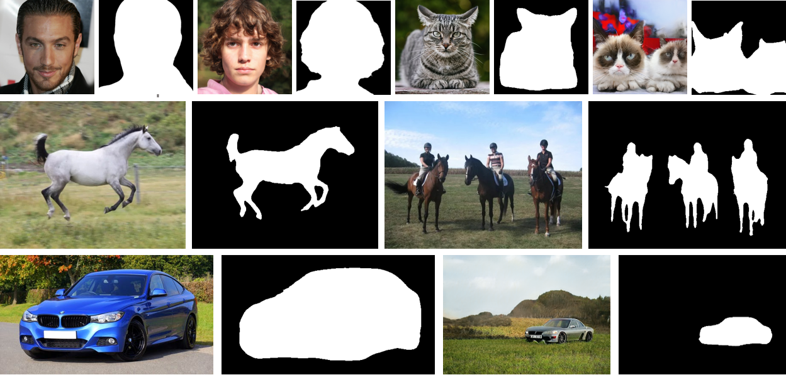

# Labels4Free: Unsupervised Segmentation using StyleGAN
## ICCV 2021


**Figure:** *Some segmentation masks predicted by Labels4Free Framework on real and synthetic images*

We propose an unsupervised segmentation framework for StyleGAN generated objects. We build on two main observations. First, the features generated by StyleGAN hold valuable information that can be utilized towards training segmentation networks. Second, the foreground and background can often be treated to be largely independent and be swapped across images to produce plausible composited images. For our solution, we propose to augment the Style-GAN2 generator architecture with a segmentation branch and to split the generator into a foreground and background network. This enables us to generate soft segmentation masks for the foreground object in an unsupervised fashion. On multiple object classes, we report comparable results against state-of-the-art supervised segmentation networks, while against the best unsupervised segmentation approach we demonstrate a clear improvement, both in qualitative and quantitative metrics.
> **Labels4Free: Unsupervised Segmentation Using StyleGAN (ICCV 2021)** <br>
>  Rameen Abdal, Peihao Zhu, Niloy Mitra, Peter Wonka <br>
>  KAUST, Adobe Research <br>


[[Paper](https://openaccess.thecvf.com/content/ICCV2021/html/Abdal_Labels4Free_Unsupervised_Segmentation_Using_StyleGAN_ICCV_2021_paper.html)]
[[Project Page](https://rameenabdal.github.io/Labels4Free/)]
[[Video](https://youtu.be/_pHunGpvLVk)]


## Installation

Clone this repo.
```bash
git clone https://github.com/RameenAbdal/Labels4Free.git
cd Labels4Free/
```

This repo is based on the Pytorch implementation of StyleGAN2 ([rosinality/stylegan2-pytorch](https://github.com/rosinality/stylegan2-pytorch)). Refer to this repo for setting up the environment, preparation of LMDB datasets and downloading pretrained weights of the models.

Download the pretrained weights of Alpha Networks [here](https://drive.google.com/file/d/1DplX40bDAZwq15S3SavO2pbqpfpbfEIT/view?usp=sharing)

## Training the models 

The models were trained on 4 RTX 2080 (24 GB) GPUs. In order to train the models using the settings in the paper use the following commands for each dataset.

Checkpoints and samples are saved in **./checkpoint** and **./sample** folders.
>FFHQ dataset
``` bash
python -m torch.distributed.launch --nproc_per_node=4 train.py --size 1024 [LMDB_DATASET_PATH] --batch 2 --n_sample 8 --ckpt [FFHQ_CONFIG-F_CHECKPOINT]--loss_multiplier 1.2 --iter 1200 --trunc 1.0 --lr 0.0002 --reproduce_model
```

>LSUN-Horse dataset
```bash
python -m torch.distributed.launch --nproc_per_node=4 train.py --size 256 [LMDB_DATASET_PATH] --batch 2 --n_sample 8 --ckpt [LSUN_HORSE_CONFIG-F_CHECKPOINT] --loss_multiplier 3 --iter 500 --trunc 1.0 --lr 0.0002 --reproduce_model
```
>LSUN-Cat dataset
```bash
python -m torch.distributed.launch --nproc_per_node=4 train.py --size 256 [LMDB_DATASET_PATH] --batch 2 --n_sample 8 --ckpt [LSUN_CAT_CONFIG-F_CHECKPOINT]  --loss_multiplier 3 --iter 900 --trunc 0.5 --lr 0.0002 --reproduce_model
```

>LSUN-Car dataset

```bash
python train.py --size 512 [LMDB_DATASET_PATH] --batch 2 --n_sample 8 --ckpt [LSUN_CAR_CONFIG-F_CHECKPOINT] --loss_multiplier 10 --iter 50 --trunc 0.3 --lr 0.002 --sat_weight 1.0 --model_save_freq 25 --reproduce_model --use_disc
```

In order to train your own models using different settings e.g on a single GPU, using different samples, iterations etc. use the following commands.

>FFHQ dataset
``` bash
python train.py --size 1024 [LMDB_DATASET_PATH] --batch 2 --n_sample 8 --ckpt [FFHQ_CONFIG-F_CHECKPOINT] --loss_multiplier 1.2 --iter 2000 --trunc 1.0 --lr 0.0002 --bg_coverage_wt 3 --bg_coverage_value 0.4
```

>LSUN-Horse dataset
```bash
python train.py --size 256 [LMDB_DATASET_PATH] --batch 2 --n_sample 8 --ckpt [LSUN_HORSE_CONFIG-F_CHECKPOINT] --loss_multiplier 3 --iter 2000 --trunc 1.0 --lr 0.0002 --bg_coverage_wt 6 --bg_coverage_value 0.6
```
>LSUN-Cat dataset
```bash
python train.py --size 256 [LMDB_DATASET_PATH] --batch 2 --n_sample 8 --ckpt [LSUN_CAT_CONFIG-F_CHECKPOINT] --loss_multiplier 3 --iter 2000 --trunc 0.5 --lr 0.0002 --bg_coverage_wt 4 --bg_coverage_value 0.35
```

>LSUN-Car dataset
```bash
python train.py --size 512 [LMDB_DATASET_PATH] --batch 2 --n_sample 8 --ckpt [LSUN_CAR_CONFIG-F_CHECKPOINT] --loss_multiplier 20 --iter 750 --trunc 0.3 --lr 0.0008 --sat_weight 0.1 --bg_coverage_wt 40 --bg_coverage_value 0.75 --model_save_freq 50
```


## Sample from the pretrained model

Samples are  saved in **./test_sample** folder.

``` bash
python test_sample.py --size [SIZE] --batch 2 --n_sample 100 --ckpt_bg_extractor [ALPHANETWORK_MODEL] --ckpt_generator [GENERATOR_MODEL] --th 0.9
```

## Results on Custom dataset

[Folder](./custom_dataset): Custom dataset, predicted and ground truth masks.
``` bash
python test_customdata.py --path_gt [GT_Folder] --path_pred {PRED_FOLDER}
```
## Citation

```
@InProceedings{Abdal_2021_ICCV,
    author    = {Abdal, Rameen and Zhu, Peihao and Mitra, Niloy J. and Wonka, Peter},
    title     = {Labels4Free: Unsupervised Segmentation Using StyleGAN},
    booktitle = {Proceedings of the IEEE/CVF International Conference on Computer Vision (ICCV)},
    month     = {October},
    year      = {2021},
    pages     = {13970-13979}
}
```


## Acknowledgments
This implementation builds upon the Pytorch implementation of StyleGAN2 ([rosinality/stylegan2-pytorch](https://github.com/rosinality/stylegan2-pytorch)). This work was supported by Adobe Research and KAUST Office of Sponsored Research (OSR).
